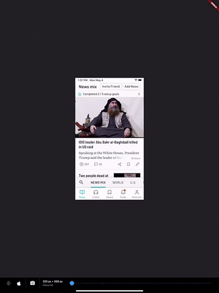

# DeviceSimulator

DeviceSimulator allows you to easily test your Flutter app for different screen resolutions and platforms. If you use this package, please consider downloading the [Newsvoice](https://newsvoice.com/app/github) app and giving us a five star review. Thanks!

With DeviceSimulator you will be able to get a quick look at what your app would look like on all iOS / iPadOS devices and a selection of common Android devices. In addition, there is a screenshot mode that makes it really easy to take screens in different resolutions for App Store and Google Play.

## Getting Started

This project was born out of the frustration of testing apps on multiple devices to make sure that the layout looked good in all resolutions. DeviceSimulator will let you quickly emulate different device types. It works best if you run it on an iPad Pro, but it also works well on the iOS Simulator and smaller tablets.

To learn more about designing for multiple resolutions, check out the [Medium article](https://medium.com/@vlidholt/building-flutter-apps-for-multiple-screen-sizes-and-devices-5ec7f86df96e) that I wrote on the topic.

### Add DeviceSimulator to your widget tree

It's really easy to add DeviceSimulator to your app. Simply add it to the root of your widget tree, right under your App widget. Build the rest of the widget tree as you would normally do. This is a minimal example:

    import 'package:flutter/material.dart';
    import 'package:device_simulator/device_simulator.dart';
    
    const bool debugEnableDeviceSimulator = true;
    
    void main() => runApp(MyApp());
    
    class MyApp extends StatelessWidget {
      @override
      Widget build(BuildContext context) {
        return MaterialApp(
          title: 'DeviceSimulator demo',
          home: DeviceSimulator(
            brightness: Brightness.dark,
            enable: debugEnableDeviceSimulator,
            child: Scaffold(
              appBar: AppBar(
                title: Text('DeviceSimulator Demo'),
              ),
              body: Center(
                child: Text('Hello multiple resolutions!'),
              ),
            ),
          ),
        );
      }
    }
 

### Known issues & limitations

- Hero animations may be broken while having the DeviceSimulator enabled. It will not affect the production ready app.
- It's currently only possible to use the home route of MaterialApp. To get around this limitation, you can place another Navigator as a child to MaterialApp.

### Caveats

I built DeviceSimulator for my own needs and it's working great for me, but it's not heavily tested and provided as is. Feedback and pull requests are most welcome.

Enjoy! / Vik